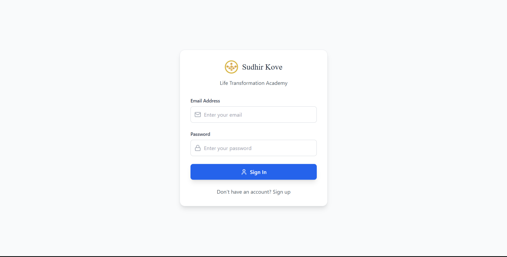
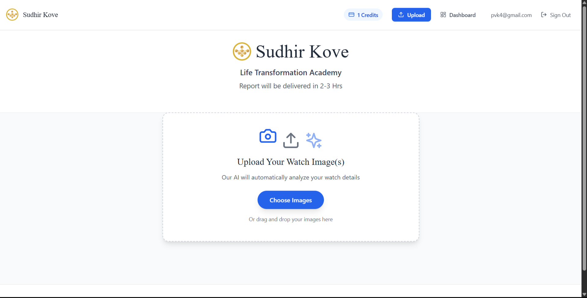
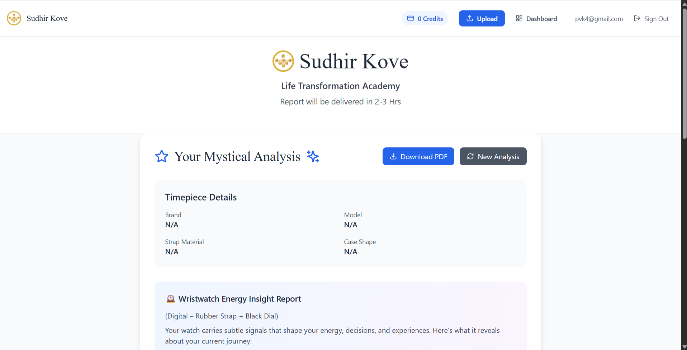
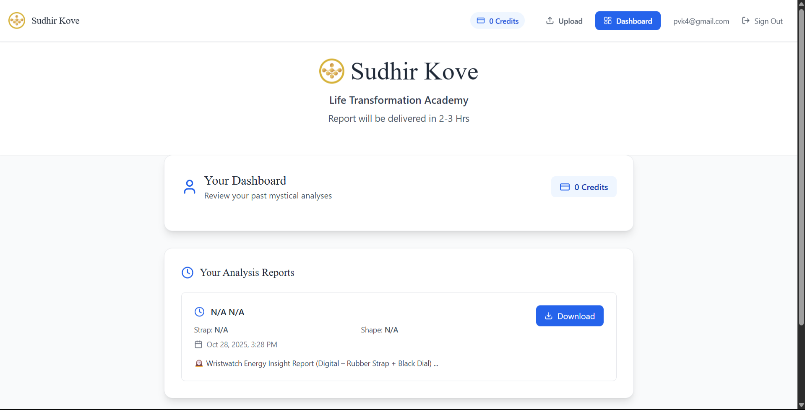

# 🕰️ Mystical Watch Analyzer

### 🚀 Overview  
Mystical Watch Analyzer is an **AI-powered full-stack web application** that interprets wristwatch images through a mystical lens using **GPT-4o**.  
Users can upload images of their watches and receive a personalized “energy analysis” based on a custom **occult doctrine** designed specifically for this project.  

The app follows a **credit-based model**, where each analysis costs one credit.  
Users can log in, upload their watches, view detailed reports, and download them as professionally formatted PDFs.

---

### 👨‍💻 My Role  
**Full-Stack Developer (Solo Project)**  
Designed, developed, and deployed the entire system — from authentication and image processing to AI integration and cloud deployment.

---

### 🧠 Key Highlights  
- 🔐 **JWT Authentication** with default credit allocation for every new user  
- 📸 **Image Upload System** using `multer` and `Axios` interceptors for secure JWT-based requests  
- 🤖 **AI Integration** with **OpenAI GPT-4o** using a custom doctrine prompt that interprets watch design, color, and shape symbolism  
- 💳 **Credit-Based System** with real-time deduction handled through Prisma transactions  
- 📄 **Dynamic PDF Generation** of AI-generated reports using `pdfkit`  
- ☁️ **Cloud Deployment**  
  - Backend → Dockerized and deployed on **GCP Cloud Run**  
  - Database → **Cloud SQL (PostgreSQL)**  
  - Frontend → **Firebase Hosting**

---

### 🧩 Tech Stack  

| Category | Tools |
|-----------|-------|
| **Frontend** | React 18, TypeScript, Tailwind CSS, Vite, Axios |
| **Backend** | Node.js, Express.js, Prisma ORM, JWT, bcrypt |
| **Database** | PostgreSQL (Cloud SQL) |
| **AI & APIs** | OpenAI GPT-4o, pdfkit, multer |
| **Cloud** | Google Cloud Run, Firebase Hosting |
| **Others** | Docker, Nginx |

---

### 🔄 User Flow  

1️⃣ **Sign Up / Log In** → new user gets 1 default credit  
2️⃣ **Upload Watch Image** → frontend validates credits and sends request  
3️⃣ **AI Analysis** → backend sends doctrine prompt + images to GPT-4o  
4️⃣ **Save Report** → Prisma transaction saves JSON + decrements credit  
5️⃣ **View Dashboard** → users can browse all previous analyses  
6️⃣ **Download PDF** → generate and download via `/api/reports/:id/pdf`

---

### 🏗️ Architecture Diagram  

**[ React Frontend ]**
**↓**
**[ Express Backend (JWT Auth, Image Upload, Prisma) ]**
**↓**
**[ OpenAI GPT-4o API ]**
**↓**
**[ PostgreSQL (Cloud SQL) ]**
**↓**
**[ PDF Report Generation → Firebase Hosting / GCP Cloud Run ]**

---

### 💡 What I Learned  
- Designing **scalable credit-based systems** with transactional safety  
- Building and deploying **JWT-protected APIs** with clean architecture  
- Integrating **AI models** into real-world full-stack environments  
- Deploying production-ready apps using **Firebase + GCP Cloud Run + Cloud SQL**

---

### 💻 Live Demo  
*https://kabir-kove.web.app/*

---

### 📸 Preview Suggestions  
Include screenshots for:  
- Login Page  

- Upload Screen  

- Analysis Report View  

- Dashboard of Previous Reports  

---

### 🧾 Disclaimer  
All analyses are **for entertainment and self-reflection purposes only**.  
© 2025 Prateek Verma
